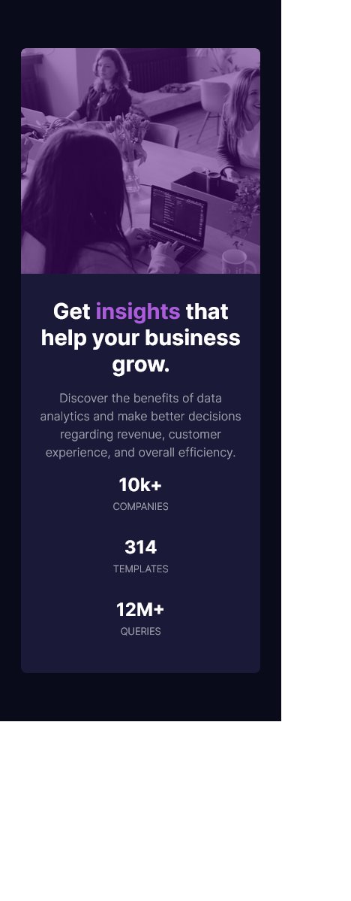
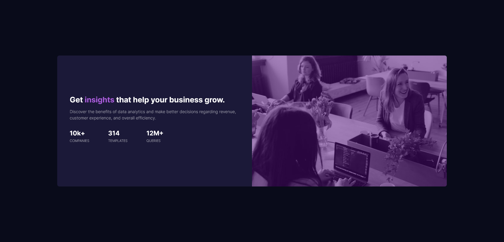

# Frontend Mentor - Stats preview card component solution

This is a solution to the [Stats preview card component challenge on Frontend Mentor](https://www.frontendmentor.io/challenges/stats-preview-card-component-8JqbgoU62). Frontend Mentor challenges help you improve your coding skills by building realistic projects. 

## Table of contents

- [Overview](#overview)
  - [The challenge](#the-challenge)
  - [Screenshot](#screenshot)
  - [Links](#links)
- [My process](#my-process)
  - [Built with](#built-with)
  - [What I learned](#what-i-learned)
  - [Continued development](#continued-development)
  - [Useful resources](#useful-resources)
- [Author](#author)
- [Acknowledgments](#acknowledgments)

## Overview
A stat preview component challenge from Front End mentor

### The challenge
Users should be able to:

- View the optimal layout depending on their device's screen size

### Screenshot

### Links

- Solution URL: [https://github.com/lrncedev/stats-preview-card/tree/main](https://github.com/lrncedev/stats-preview-card/tree/main)
- Live Site URL: [https://lrncedev.github.io/stats-preview-card/](https://lrncedev.github.io/stats-preview-card/)

## My process
Just like the Product preview card, i made this using div and inside the div, are 2 sub divs. Which are my flex-items.

The first flex item is for the image, while the latter is for the texts.
As for the desktop view, i used row-revers instead of 'order'. 
Set the flex-items to both 100% width, although there are still discrepancies on sizing because of margins and paddings that i used.
### Built with

- Semantic HTML5 markup
- CSS custom properties
- Flexbox
- Mobile-first workflow

### What I learned

I used row-reverse instead of order now. I usually think of using orders instead of row-reverse. Also utilized creating mobile-first approac.

### Continued development

Will be fixing the tint color of the image, as well as the size. Probably gonna fixed the mobile view sizing too.

### Useful resources

## Author
- Website - [Laurence Cadag](https://lrncedev.github.io/vueport/)
- Frontend Mentor - [@lrncedev](https://www.frontendmentor.io/profile/@lrncedev)
- Twitter - [@Cadsu3](https://www.twitter.com/@Cadsu3)
